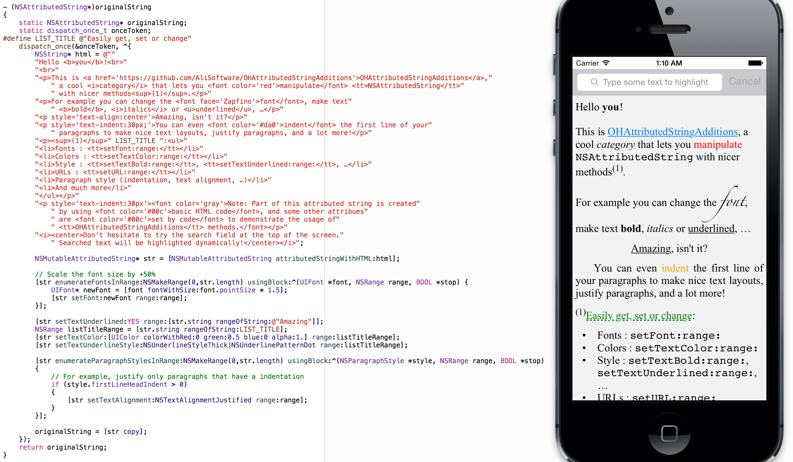

# OHAttributedStringAdditions

[](http://cocoadocs.org/docsets/OHAttributedStringAdditions)
[](http://cocoadocs.org/docsets/OHAttributedStringAdditions)
[](https://travis-ci.org/AliSoftware/OHAttributedStringAdditions)

This pod contains categories on `NSAttributedString` to add a lot of very useful convenience methods to manipulate attributed strings.

Convenience methods include:

* **font** manipulation (`setFont:range:` and `fontAtIndex:effectiveRange:`)
* **text color** (`setTextColor:range:` and `textColorAtIndex:effectiveRange:`)
* **background color**
* **bold**, *italics* and *underline* styles
* add **URLs** to your text
* **paragraph styles** (**indentation**, **line spacing**, …)
* baseline adjustment, **subscript**, **superscript**, …
* And much more

It also contains:

* A category on `UIFont` to build a font given its postscript name and derive a bold/italic font from a standard one and vice-versa.
* A category on `UILabel` to make it easier to detect the character at a given coordinate, which is useful to detect if the user tapped on a link (if the character as a given tapped `CGPoint` has an associated `NSURL`) and similar stuff

> Note that for advanced URL detection, you should still prefer `UITextView` (configuring it with `editable=NO`) and its dedicated delegate methods instead of using `UILabel` (which does not publicly expose its `NSLayoutManager` to properly compute the exact way its characters are laid out, forcing us to recreate the TextKit objects ourselves, contrary to `UITextView`).

## Documentation

The source code is fully commented and documentation is auto-generated [here](http://cocoadocs.org/docsets/OHAttributedStringAdditions).

There is also some help pages [in the repository's wiki](https://github.com/AliSoftware/OHAttributedStringAdditions/wiki).

## Installation

The suggested installation is via [CocoaPods](http://cocoapods.org/). Simply add the following line to your `Podfile`:

```
pod 'OHAttributedStringAdditions'
```

Then do a `pod install`.

## Example

A demo project is provided in the repository. Don't hesitate to open `Example/AttributedStringDemo.xcworkspace` and play with it.

If you have CocoaPods, you can even try that Sample project even if you don't have cloned the project yet, by using `pod try OHAttributedStringAdditions` in your terminal.



## Future improvements

* Improving **documentation on edge cases**, like documenting the behavior about when some attribute is not present or if we are allowed to pass nil to arguments.
* Adding **support for OSX**. This should only need little adjustments, like getting rid of the `#import <UIKit/UIKit.h>` in the pch file, or replacing `UIColor` and `UIFont` classes with `NSColor` and `NSFont` (using macros to switch from one to another depending on the SDK), but that still requires some work and tests.

> _Note: The original code of these categories comes from my old `OHAttributedLabel` pod, which is now deprecated as I don't have time to maintain it. As this previous implementation was based on CoreText and was not compatible (sometimes even crash) with UIKit/TextKit, I converted those categories to create this UIKit-compliant `NSAttributedString`, not related to CoreText and `OHAttributedLabel` anymore and that now work with latest versions of iOS/UIKit/TextKit._

## Licence

This component is under the MIT Licence (See the `LICENSE` file).
