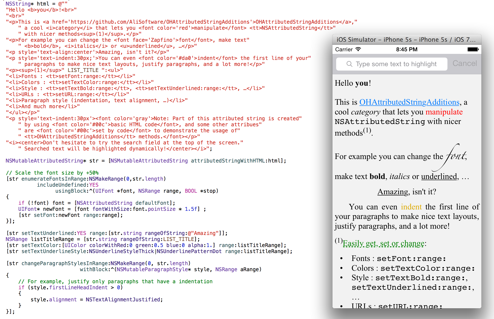

# OHAttributedStringAdditions

[](http://cocoadocs.org/docsets/OHAttributedStringAdditions)
[](http://cocoadocs.org/docsets/OHAttributedStringAdditions)
[](https://travis-ci.org/AliSoftware/OHAttributedStringAdditions)

This pod contains categories on `NSAttributedString` to add a lot of very useful convenience methods to manipulate attributed strings.

Convenience methods include:

* **font** manipulation (`setFont:range:` and `fontAtIndex:effectiveRange:`)
* **text color** (`setTextColor:range:` and `textColorAtIndex:effectiveRange:`)
* **background color**
* **bold**, *italics* and *underline* styles
* add **URLs** to your text
* **paragraph styles** (**indentation**, **line spacing**, …)
* baseline adjustment, **subscript**, **superscript**, …
* And much more

## Installation

The suggested installation is via [CocoaPods](http://cocoapods.org/). Simply add the following line to your `Podfile`:

```
pod 'OHAttributedStringAdditions'
```
Then do a `pod install`.

## Documentation

The source code is fully commented and documentation is auto-generated [here](http://cocoadocs.org/docsets/OHAttributedStringAdditions)

## Example

A demo project is provided in the repository. Don't hesitate to open `Example/AttributedStringDemo.xcworkspace` and play with it.



## Future improvements

This pod is in its early release. A lot of improvements are already planned to be released soon:

* Adding **Unit Tests for methods of the `NSMutableAttributedString`** category (for now UnitTests exists for the `UIFont` and `NSAttributedString` category only)
* Improving **documentation on edge cases**, like documenting the behavior about when some attribute is not present or if we are allowed to pass nil to arguments.
* Adding **support for OSX**. This should only need little adjustments, like getting rid of the `#import <UIKit/UIKit.h>` in the pch file, or replacing `UIColor` and `UIFont` classes with `NSColor` and `NSFont` (using macros to switch from one to another depending on the SDK), but that still requires some work.

> _Note: The original code of these categories comes from my old `OHAttributedLabel` pod, which is now deprecated as I don't have time to maintain it. But as those categories were still useful I extracted them in a dedicated pod and converted them to create UIKit-complient `NSAttributedString`, not related to CoreText anymore._

## Licence

This component is under the MIT Licence
